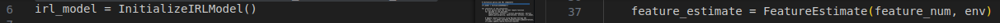
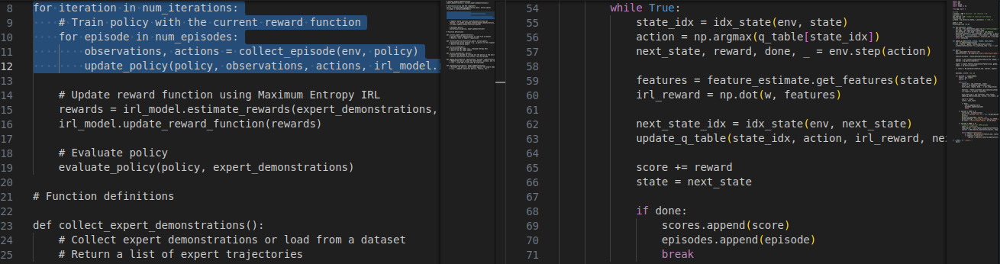
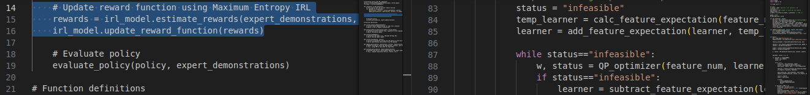
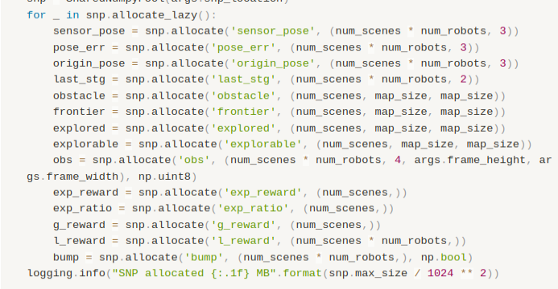

# Pseudo code 對應到 mountain car IRL 的地方

1. expert data 輸入以及獲取：
   
pseudocode 第1行 >>> 對應到 train.py 中的

2. 初始化 policy：
   
pseudocode 第2行 >>> 對應到 train.py 中的

3. 初始化 IRL 模型（參數）：
   
pseudocode 第3行 >>> 對應到 train.py 中的

4. 收集環境互動（Collect episode）、更新策略 (Update policy) 、估計獎勵 (Estimate rewards):
   
pseudocode 第10-14行迴圈 >>> 對應到 train.py 中的

5. 估計獎勵 (Estimate rewards) 、並更新獎勵函數 (Update reward function):
   
pseudocode 第16-17行 >>> 對應到 train.py 中的:

## 下一步 製作 Expert Data

neuralcomapping 儲存配置

預計會將 sensor_pose, origin_pose, obstacle, frontier, explored, explorable,  ??reward 放入 expert data 中。

## Data Structure 構想

如果要以 mountaincar 為基礎去修改成 unknown environment exploration 的話
